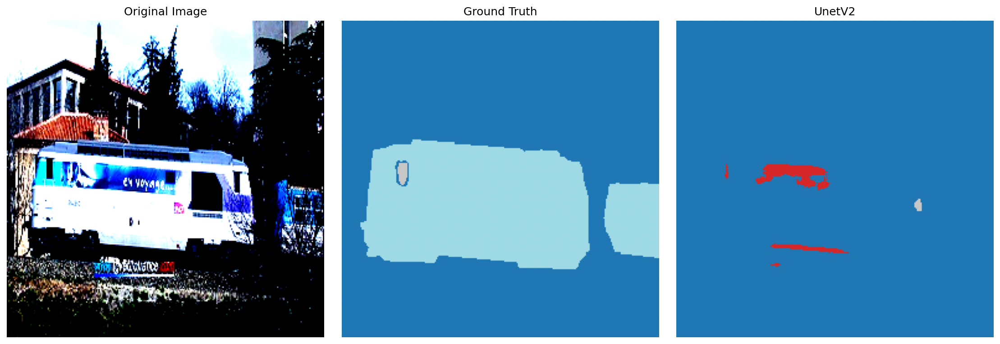
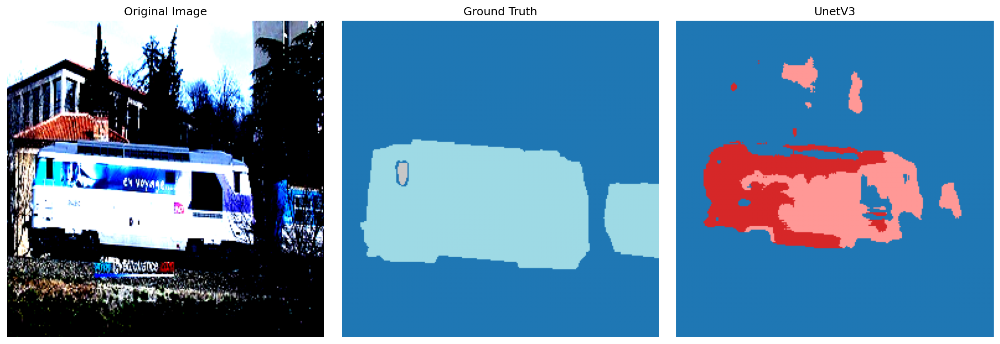
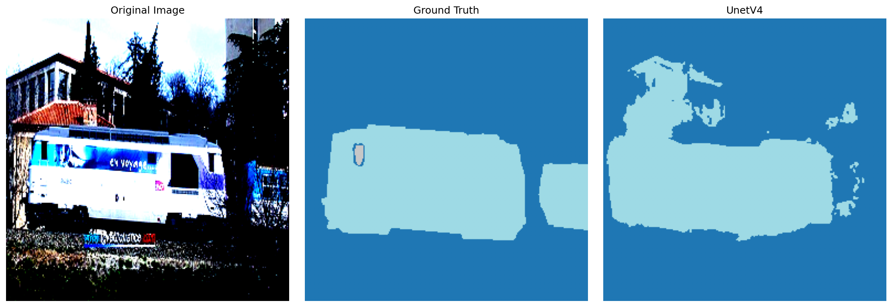

# unet-architecture-study
This project documents a 4-stage architectural journey to solve semantic segmentation on PASCAL VOC dataset(approximately 2-3 k images). Rather than jumping straight to a complex model, I evolved the architecture to solve specific failure modules identified through deep model inspection.

# Stage 1: Weighted Cross-Entropy Loss (UnetV1)
- **The Result:** The model identifies the train's location but suffers from **extreme class hallucination.** Because the loss function treats miclassifying target class pixels the same as misclassifying background pixels, it predicts rare textures (red/pink masks) inside the train body. It lacks the "discipline" to distinguish between similar semantic features.
  

# Stage 2: Dice Loss Integration (UnetV2)
- **The Result:** Replacing weighted Cross Entropy Loss with Focal Loss provides a more granular focus on hard-to-classify pixels, and Dice Loss optimizes for structural overlap. The hallucinations are drastically reduced, and the noise is cleared. However, the model becomes "timid"—it lacks the spatial receptive field to understand the full scale of the train.
   

# Stage 3: Atrous Spatial Pyramid Pooling (ASPP)
- **The Result:** By utilizing **Atrous Spatial Pyramid Pooling (ASPP),** the model gains the ability to extract features at multiple sampling rates. This 'multi-scale' context allows it to resolve large objects as a single coherent entity without sacrificing fine-grained detail. It finally captures the entire body of the train as a single coherent object. However, because the encoder is still a basic custom implementation, it struggles with the final "semantic label," resulting in a class mismatch despite an accurate shape.
    

# Stage 4: ResNet-34 Pre-trained Backbone
- **The Result:** By replacing the custom encoder with a pre-trained **ResNet-34**, the model leverages "semantic maturity" - the ability to recognize complex object properties developed over millions of images. It ties the spatial gains of V3 to the correct semantic label (light blue for 'Train'). This final iteration bridges the gap between spatial detection and semantic accuracy. The ResNet features provide the necessary stability to resolve the class assignment mismatch seen in previous iterations, resulting in a mask that is both spatially and semantically precise.
  
  
